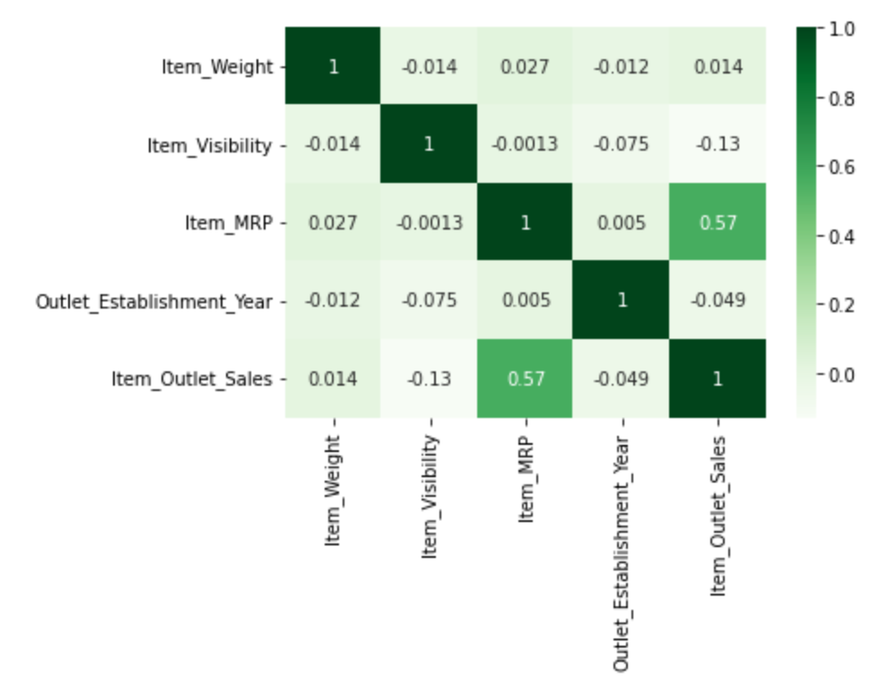

# project1 - sales predictions
# Predicting Future Sales
## Using preprocessing and data modelling

Jerry Qian

### Business problem:

The goal is to help the retailer by using machine learning to make predictions about future sales based on the data provided.

### Data:
I provide visualizations for the data, detailed below. I also examine the data using preprocessing and regression modeling.

## Methods
- Preprocessing and data modelling to examine the training data and testing data accuracy
- Visualizations to help understand the data

## Results

#### Visual 1 Title

> From the heatmap visualization, we can see a strong correlation between Item_MRP and Item_Outlet_Sales. However, there are no strong correlations other than this.

#### Visual 2 Title

## Model

The final model is a linear regression model. I excluded object-type columns, and used SimpleImputer to fill in columns with missing info. Then, I did the OneHotEncoder and scaled the numeric data. 

After concatenating the numeric and OHE data, we created model predictions and evaluated performance based on R2 and RMSE. Based on the R2 data, we can see that the model accounts for about 34% of the variation in y_test using the features in X_test. The results for R2 are on a consistent scale. Also, from its RMSE data, larger errors get hit with greater magnitude.

### For further information

For any additional questions, please contact jerryqian123@gmail.com
